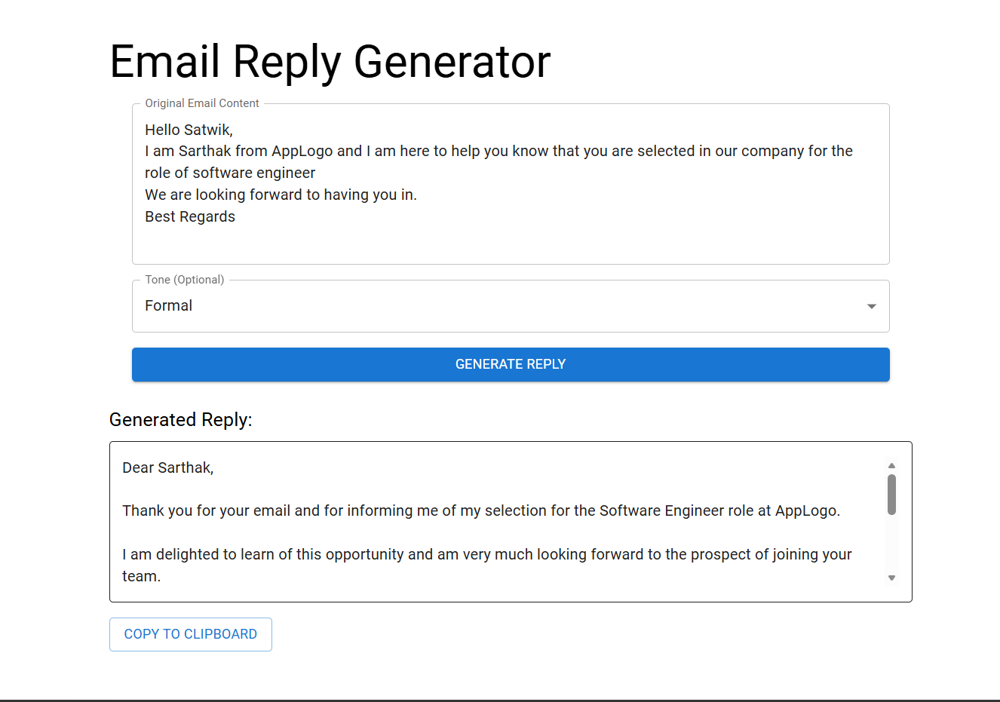

# 🚀 AI Email Generator

An AI-powered Email Generator built using **React.js**, **Spring Boot**, and **Generative AI (Gemini/Llama)**. The application generates professional, context-aware email replies based on user input and allows users to customize the response tone.

---

# 📌 Features

* AI-powered email generation
* Multiple email tones

  * Professional
  * Formal
  * Friendly
  * Concise
* Spring Boot REST API
* React Frontend
* Real-time email generation
* Responsive UI
* WebClient Integration
* Error Handling & Validation

---

# 🏗️ Project Structure

## Frontend Structure (React + Vite)

```text
EMAIL-WRITER-REACT
│
├── node_modules
├── public
│
├── src
│   ├── assets
│   │   └── react.svg
│   │
│   ├── App.css
│   ├── App.jsx
│   ├── index.css
│   └── main.jsx
│
├── .gitignore
├── eslint.config.js
├── index.html
├── package-lock.json
├── package.json
├── README.md
└── vite.config.js
```

---

## Backend Structure (Spring Boot)

```text
EmailWriter
│
├── .idea
├── .mvn
│
├── src
│   ├── main
│   │
│   ├── java
│   │   └── com.email.writer
│   │       │
│   │       ├── app
│   │       │   ├── EmailGeneratorController.java
│   │       │   ├── EmailGeneratorService.java
│   │       │   ├── EmailRequest.java
│   │       │   └── WebClientConfig.java
│   │       │
│   │       └── EmailWriterApplication.java
│   │
│   └── resources
│       ├── static
│       ├── templates
│       └── application.properties
│
├── test
├── target
├── pom.xml
├── mvnw
└── mvnw.cmd
```

---

# 🛠️ Technologies Used

### Frontend

* React.js
* Vite
* JavaScript
* CSS

### Backend

* Java
* Spring Boot
* Spring Web
* Spring WebFlux
* WebClient
* Maven

### AI

* Google Gemini API
* Llama API (Optional)

---

# ⚙️ Setup Instructions

## Step 1: Clone Repository

```bash
git clone https://github.com/yourusername/AI-Email-Generator.git
```

```bash
cd AI-Email-Generator
```

---

# 🚀 Run Backend

## Open Backend in IntelliJ IDEA

Open:

```text
EmailWriter
```

project in IntelliJ.

Navigate to:

```text
src/main/java/com/email/writer/EmailWriterApplication.java
```

Run:

```java
EmailWriterApplication
```

or use:

```bash
mvn spring-boot:run
```

If successful you should see:

```text
Tomcat started on port 8080
Started EmailWriterApplication
```

Backend runs on:

```text
http://localhost:8080
```

---

# 🚀 Run Frontend

## Open Frontend in VS Code

Open:

```text
EMAIL-WRITER-REACT
```

project in VS Code.

Install dependencies:

```bash
npm install
```

Start development server:

```bash
npm run dev
```

You should see:

```text
Local: http://localhost:5173
```

Frontend runs on:

```text
http://localhost:5173
```

---

# 🔗 API Endpoint

### Generate Email

```http
POST /api/email/generate
```

Request:

```json
{
  "emailContent": "Can we schedule a meeting tomorrow?",
  "tone": "professional"
}
```

Response:

```json
{
  "generatedEmail": "Thank you for reaching out. I would be happy to schedule a meeting tomorrow..."
}
```

---

# 🔥 Supported Tones

| Tone         | Description                |
| ------------ | -------------------------- |
| Professional | Business communication     |
| Formal       | Official communication     |
| Friendly     | Casual communication       |
| Concise      | Short and direct responses |

---

# 🔧 Configuration

Inside:

```text
src/main/resources/application.properties
```

Configure:

```properties
gemini.api.url=https://generativelanguage.googleapis.com/v1beta/models/gemini-2.0-flash:generateContent?key=
gemini.api.key=YOUR_API_KEY
```

---

# 🖥️ Workflow

```text
User Input
     │
     ▼
React Frontend
     │
     ▼
Spring Boot REST API
     │
     ▼
Generative AI API
(Gemini / Llama)
     │
     ▼
Generated Email
     │
     ▼
React UI
```

---

## 📸 Screenshot


```

---

# 👨‍💻 Author

**Satwik Saxena**

* Full Stack Developer
* Java & Spring Boot Developer
* AI Enthusiast

GitHub:
https://github.com/satwik12dev

---

# ⭐ Support

If you found this project useful, please consider giving it a ⭐ on GitHub.
